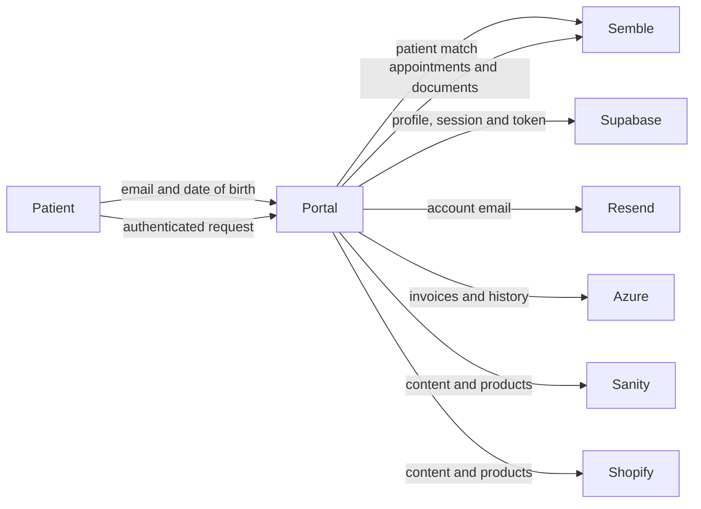

# Data Protection Impact Assessment — Indra Patient Portal

**Status:** Draft for controller and privacy-review approval
**Version:** 1.0
**Assessment date:** 30 September 2026
**Controller:** [Confirm legal entity]
**Privacy lead / DPO:** [Confirm name and contact]
**Technical owner:** [Confirm name and contact]

## 1. Purpose and decision

This is a concise DPIA record for the Indra patient portal source-code
handover. It describes processing evident in the application and identifies
the decisions and evidence that remain with the controller and service owners.
It is not legal advice and does not approve production processing.

A DPIA is appropriate because the portal links patient identity, health and
care information, account credentials, and billing information across several
services. The controller must confirm the final risk assessment, lawful basis,
special-category condition, supplier roles, and residual-risk acceptance before
production use. ICO DPIA guidance is the reference for this assessment:
[Data protection impact assessments](https://ico.org.uk/for-organisations/uk-gdpr-guidance-and-resources/accountability-and-governance/guide-to-accountability-and-governance/data-protection-impact-assessments/).

## 2. Processing overview

The portal is a Next.js application that lets authenticated patients access
appointments, prescription documents, invoices, billing history, content, and
external service links. It uses:

- Supabase for authentication, session cookies, portal profiles, and one-time
  registration and password-reset tokens;
- Semble for patient matching, appointments, and prescription documents;
- a separately supplied Azure API for invoices and billing history;
- Resend for account emails;
- Sanity for editorial content; Shopify for products; and Vimeo or YouTube for
  resource video embeds.

The source handover does not include credentials, patient data, Supabase Auth
users, Sanity data, Azure implementation, hosting settings, supplier contracts,
or operational logs.

### Data subjects and information

| Data subjects | Information processed |
|---|---|
| Existing and prospective patients | Name, email, date of birth, Supabase user ID, Semble patient ID, account/session state, registration and reset tokens |
| Authenticated patients | Appointments, meeting links, prescription document metadata and links, invoices, payment links, billing history, and portal activity needed to operate the service |
| Staff or clinicians where present in source data | Appointment and meeting details |

Health and care information is likely special-category data. Billing details,
meeting links, document URLs, authentication data, and dates of birth also
require strong confidentiality controls.

### Data flow

## 3. Necessity, proportionality, and governance decisions

The portal uses an existing patient record to link an account to the relevant
appointments, documents, and billing information. Authentication and account
recovery are necessary to protect that information. The controller must still
confirm and document:

- the Article 6 lawful basis for each purpose;
- the Article 9 condition and any required DPA 2018 basis for health data;
- patient privacy information, retention periods, and procedures for access,
  correction, deletion where applicable, and complaints;
- controller, processor, or separate-controller roles for each supplier;
- hosting locations, subprocessors, and any international-transfer safeguards;
- the age, capacity, and proxy-access model; and
- whether email plus date of birth provides identity assurance proportionate to
  the information made available.

The [ICO's special-category data guidance](https://ico.org.uk/for-organisations/uk-gdpr-guidance-and-resources/lawful-basis/special-category-data/what-are-the-rules-on-special-category-data/)
should be used when finalising the Article 9 condition.

## 4. Measures evidenced in the source

- Protected routes verify the Supabase user on the server; middleware refreshes
  expiring sessions through Supabase's cookie mechanism.
- Registration matches an exact Semble email against a submitted date of birth.
- Registration and password-reset links use cryptographically random tokens
  and expire after one hour.
- Password-reset tokens are claimed atomically for five minutes, released after
  a failed password update, and marked used after success.
- Account creation requires successful linking of the portal profile to the
  Auth user; a failed new-user link is cleaned up, and a valid retry can repair
  a prior unlinked account.
- Forgot-password responses do not disclose whether an account exists.
- Supabase, Semble, Azure, and Resend credentials are used from server-side
  modules.
- Semble registration matching is paginated, checks exact email safely, and
  retains date-of-birth verification.
- Patient-safe failure states are provided for invoices and settings, with a
  retryable frontend error screen for unexpected route errors.

These code-level measures do not establish the configuration of suppliers,
hosting, logs, database policies, or operational controls.

## 5. Risk and action register

| Risk to individuals | Current source position | Required owner action | Status |
|---|---|---|---|
| Account compromise exposes care or billing information | Session refresh, one-time reset claims, and registration-recovery handling are implemented | Confirm password policy, Supabase settings, monitoring, and whether stronger identity assurance or MFA is required | Open: controller / platform owner |
| A person incorrectly matches or cannot match a patient record | Exact email and date-of-birth check, paginated Semble results, and a generic failure response are implemented | Confirm Semble search semantics, duplicate-record process, support route, rate limits, and registration assurance | Open: clinical and product owner |
| Billing information is disclosed by the Azure API | Portal request is server-to-server; no endpoint implementation or credential is present in this repository | Evidence endpoint authentication, per-patient authorisation, network controls, logging, retention, and incident ownership | Open: Azure service owner |
| Credentials, profiles, or tokens are misused | Secrets are excluded from source and server-side modules use administrative credentials | Confirm Supabase RLS, Auth settings, least privilege, key rotation, backups, and administrative-access controls | Open: platform owner |
| Third-party processing or transfers are unclear | Supplier integrations are identifiable in source | Confirm contracts, processor roles, regions, subprocessors, cookie/media assessment, and transfer safeguards | Open: controller / privacy lead |
| Service failure, vulnerable dependency, or weak operational response harms patients | Code has targeted error handling and route error recovery | Run vulnerability and security checks, set patching and monitoring ownership, complete testing, and provide clinical/support continuity routes | Open: technical and operations owner |

## 6. Consultation and evidence required for approval

Before approval, obtain and retain:

- controller and DPO/privacy-lead review, including lawful-basis and
  special-category-condition decisions;
- clinical, security, support, and patient-representative input proportionate
  to the service;
- Supabase schema, RLS, Auth, backup, retention, and access-control evidence;
- Azure API ownership, threat model, authentication and authorisation test
  evidence;
- supplier contracts, DPAs, regions, subprocessors, and transfer assessments;
- privacy notice, cookie/media assessment, retention schedule, and
  subject-rights procedure;
- vulnerability, authorisation, accessibility, recovery, and incident-response
  test results; and
- an approved residual-risk decision with named owners and review dates.

If a high risk to individuals remains after reasonable mitigation, the
controller must consider prior consultation with the ICO before commencing the
relevant processing.

## 7. Approval and review

| Role | Name | Decision | Date |
|---|---|---|---|
| Project owner | [Name] | [Approve / reject / conditional] | [Date] |
| Privacy lead or DPO | [Name] | [Advice / conditions] | [Date] |
| Information security owner | [Name] | [Approve / conditions] | [Date] |
| Clinical or operational owner | [Name] | [Approve / conditions] | [Date] |
| Controller's accountable approver | [Name] | [Final decision] | [Date] |

Review this DPIA before production use and after any material change to
authentication, patient matching, suppliers, hosting region, data categories,
proxy access, analytics, security incidents, or the purpose and scale of
processing.
