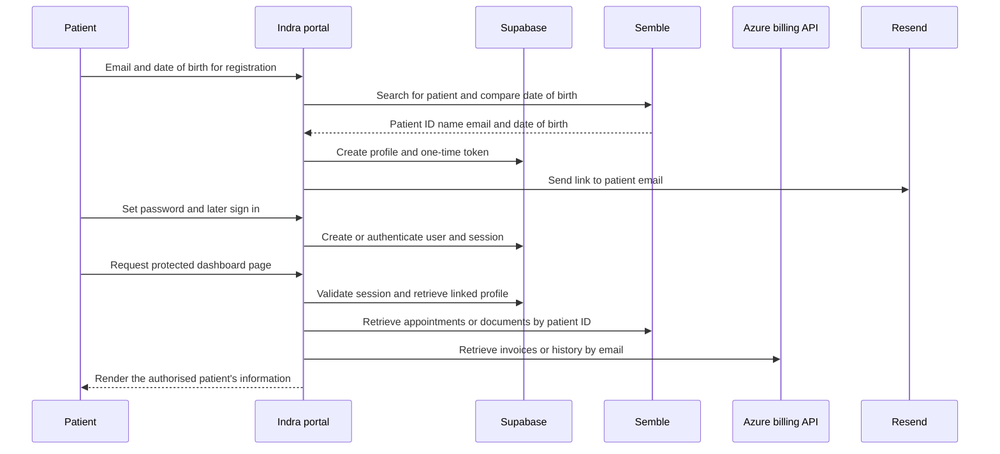

# Data Protection Impact Assessment for the Indra Patient Portal

**Document status:** Draft requiring controller review and approval  
**Version:** 0.1  
**Assessment date:** 23 September 2026  
**Project:** Indra patient portal  
**Controller:** [Confirm legal entity]  
**Joint controller if applicable:** [Confirm or state none]  
**DPO or privacy lead:** [Name and contact]  
**Project owner:** [Name and role]  
**Technical owner:** [Name and role]  
**Planned review date:** [Date]  
**Approval decision:** Not approved pending the actions in section 12

## 1. Executive decision

A DPIA is required. The portal processes health information and other highly personal information about patients, links identity records across systems, and makes medical documents, appointments, meeting links, and billing information available through an online account. Patients may be vulnerable data subjects. Unauthorised disclosure, incorrect matching, or account compromise could cause significant distress, confidentiality loss, financial harm, discrimination, or interference with care.

The processing has a legitimate operational purpose, but production approval should remain conditional until the controller confirms the legal and governance details in this assessment and closes the high-priority technical measures. In particular, the password-reset token defect, registration abuse controls, Azure API protection, database access controls, retention schedule, supplier contracts, and international transfer position require evidence.

This assessment is a working accountability record for review by the controller and its DPO or privacy adviser. It does not replace legal advice.

## 2. Why a DPIA is required

The UK Information Commissioner's Office states that a DPIA is required before processing that is likely to result in a high risk to individuals. Relevant indicators here include:

- processing data concerning health, which is special-category data;
- providing access to health services and medical documents through identity matching;
- combining identifiers and records across authentication, clinical, billing, communications, and content systems;
- processing information relating to potentially vulnerable individuals; and
- using multiple cloud suppliers and possible international access or transfers.

The controller must identify an Article 6 lawful basis and a separate Article 9 condition for special-category data before processing begins. These choices must be recorded in the privacy notice and records of processing.

Relevant official guidance:

- [ICO guidance on data protection impact assessments](https://ico.org.uk/for-organisations/uk-gdpr-guidance-and-resources/accountability-and-governance/guide-to-accountability-and-governance/data-protection-impact-assessments/)
- [ICO guidance on special-category data](https://ico.org.uk/for-organisations/uk-gdpr-guidance-and-resources/lawful-basis/special-category-data/what-are-the-rules-on-special-category-data/)
- [ICO guide to lawful basis](https://ico.org.uk/for-organisations/uk-gdpr-guidance-and-resources/lawful-basis/a-guide-to-lawful-basis/)
- [ICO guide to data security](https://ico.org.uk/for-organisations/uk-gdpr-guidance-and-resources/security/a-guide-to-data-security/)
- [ICO guide to international transfers](https://ico.org.uk/for-organisations/uk-gdpr-guidance-and-resources/international-transfers/a-guide-to-international-transfers/what-is-an-international-transfer-of-personal-information/)

## 3. Processing description

### 3.1 Nature and purpose

The Indra portal gives an authenticated patient a single interface for information held in several systems. The purposes evidenced in the application are:

1. Verify that a registering person matches an existing patient record.
2. Create and administer a secure patient portal account.
3. Display appointments and enable access to consultation meeting links.
4. Display and enable download of prescription documents.
5. Display unpaid invoices, payment links, and billing history.
6. Provide health, wellbeing, and patient-support content.
7. Provide product and subscription-management links.
8. Send account registration and password-reset communications.

The portal is not shown making clinical decisions, profiling patients, or using solely automated processing to produce legal or similarly significant effects. Its registration match does, however, determine access to a service and sensitive records, so false matches and false rejections require careful control and a human support route.

### 3.2 Data subjects

- Current or prospective Indra patients who already have a record in Semble.
- Portal users managing their own account.
- Potentially vulnerable adults and, if permitted by the service, children or people represented by a guardian. The actual age range and proxy-access model must be confirmed.
- Clinical and administrative staff whose names or meeting details may appear in appointment information or communications.

### 3.3 Personal information

| Category | Examples evidenced or reasonably implied by the application | Sensitivity |
|---|---|---|
| Identity | First name, last name, Supabase user ID, Semble patient ID | Personal information |
| Contact | Email address | Personal information |
| Authentication | Password handled by Supabase Auth, session cookies, registration and reset tokens | Confidential credential data |
| Demographic | Date of birth used during registration | Highly personal information |
| Health and care | Patient status, appointments, appointment type, dates and times, prescription document names and contents, clinical document links | Special-category health data |
| Consultation access | Video meeting URL | Sensitive access information |
| Financial | Invoice references, product or service descriptions, quantities, amounts, payment status, paid dates, transaction ID, delivery fees and payment link | Personal and potentially health-revealing financial information |
| Technical | IP address and request metadata handled by hosting and suppliers, browser time zone, session state, navigation history stored in the browser | Personal information where linked or linkable |
| Communications | Recipient email, first name, registration or reset link and provider delivery metadata | Personal and confidential information |

The portal should not intentionally collect free-text clinical information. Supplier logs, support communications, and document contents may contain further information and must be included in the controller's complete data inventory.

### 3.4 Sources and recipients

| Source | Information obtained | Recipient or use |
|---|---|---|
| Patient | Email, date of birth, password and account actions | Portal, Supabase, Semble matching, Resend where required |
| Supabase | Authenticated user and portal profile | Portal authorisation and linking to Semble |
| Semble | Patient match, name, date of birth, appointments, meeting URL, documents and download URL | Display to the authenticated patient |
| Azure API and its underlying billing systems | Invoices and billing history | Display to the authenticated patient |
| Sanity | Editorial content and media references | Display to users |
| Shopify | Product catalogue and product links | Display to users |
| Patient browser | Time zone and normal web request metadata | Local date display and hosting or supplier operation |

### 3.5 Data flow

### 3.6 Scale, frequency, and duration

These values are not available in the repository and must be completed by the controller:

| Measure | Value to confirm |
|---|---|
| Number of registered patients | [Insert current and forecast figures] |
| Number of active users per month | [Insert] |
| Geographic coverage | [Insert] |
| Age range | [Insert] |
| Appointment and document volume | [Insert] |
| Invoice volume | [Insert] |
| Intended processing duration | While the portal service operates, subject to category-specific retention |

## 4. Roles and supplier assessment

The roles below are provisional. The controller must confirm them in contracts and the record of processing activities.

| Party or service | Likely role for this processing | Personal information involved | Location and transfer position | Required evidence |
|---|---|---|---|---|
| Indra legal entity | Controller | All portal-linked patient information | Confirm | Controller identity and registration details |
| Development or support provider | Processor if it can access production information | Potentially all information during support | Confirm | Article 28 terms, access controls, confidentiality and support procedure |
| Supabase | Processor | Accounts, sessions, profiles and tokens | Confirm project region and remote access | DPA, subprocessor list, security evidence and transfer mechanism |
| Vercel or actual host | Processor | Requests, rendered data, logs and deployment configuration | Confirm region and logs | DPA, regions, subprocessor list, retention and transfer mechanism |
| Semble | Processor or separate controller depending on the care relationship | Clinical and patient information | Confirm | Role analysis, data sharing or processing terms and API controls |
| Azure service and billing provider | Processor or separate controller | Patient identifiers and billing information | Confirm | Owner, hosting region, DPA or sharing agreement, API controls and retention |
| Resend | Processor | Email, name, secure link and delivery metadata | Confirm | DPA, subprocessor list, retention and transfer mechanism |
| Sanity | Processor for managed content; should not hold patient records | Editorial information and administrator accounts | Confirm | DPA, admin controls, regions and transfer mechanism |
| Shopify | Separate controller for external purchases; processor for catalogue requests only if applicable | Product requests; purchase data after user follows the external link | Confirm | Clear user notice and role analysis |
| Mux, Vimeo, YouTube and noembed.com | Separate providers or processors depending on configuration | IP address, device and media request data | Confirm | Cookie assessment, privacy information, contracts where applicable and transfer assessment |

If a supplier or its subprocessor can access personal information from outside the UK, the controller must determine whether this is a restricted transfer and document the applicable adequacy regulation, UK IDTA, UK Addendum, or other safeguard. A transfer risk assessment may also be required. Supplier marketing material is not sufficient evidence by itself.

## 5. Lawful basis and compatibility

The table below records a proposed starting position, not a final legal determination.

| Purpose | Proposed Article 6 basis | Proposed Article 9 condition | Decision needed |
|---|---|---|---|
| Provide portal access to existing patients, appointments, prescriptions and care-related records | Article 6(1)(b), contract, or Article 6(1)(c), legal obligation, depending on the care arrangement | Article 9(2)(h), health or social care, with the relevant UK law and professional-secrecy safeguards | Controller and DPO or legal adviser must confirm the care relationship and applicable law |
| Account security, fraud prevention, audit and incident response | Article 6(1)(f), legitimate interests, or Article 6(1)(c) where a legal security obligation applies | Article 9(2)(h) if the security record necessarily reveals health-service use; minimise wherever possible | Complete and retain a legitimate interests assessment if relying on legitimate interests |
| Billing and payment administration | Article 6(1)(b), contract, and where applicable Article 6(1)(c), legal obligation | Article 9 condition may be required where line items or context reveal health information | Confirm controller's billing and tax requirements and minimise clinical detail |
| Transactional account email | Same basis as the account operation it supports | Normally not separately required unless content reveals health information; the context may itself be revealing | Keep subject lines and content discreet and confirm email retention |
| Optional embedded media and product links | Article 6 basis depends on whether processing is necessary or optional; consent may be needed for non-essential cookies or similar technologies | Not expected unless viewing behaviour is used to infer health information | Complete cookie and third-party media assessment |

The final lawful-basis decision must be made before go-live, documented in privacy information, and kept consistent with the purpose. Consent should not be selected merely because health data is involved; it must be freely given, specific, informed, unambiguous, and withdrawable if relied upon.

## 6. Necessity and proportionality

### 6.1 Assessment

The portal can reduce administrative friction and give patients direct access to information relating to their care. Linking the portal identity to an existing Semble patient record is necessary to present the correct information. Authentication and secure account recovery are necessary to protect confidentiality. Retrieval of appointment, prescription, and billing information is directly connected to the user-facing service.

The following aspects require further evidence or adjustment to demonstrate data minimisation and proportionality:

- Registration currently relies on email and date of birth. These values may be known to family members, carers, employers, or attackers and may not provide assurance proportionate to access to medical documents.
- The prescription journey retrieves all patient documents available from the Semble endpoint and filters them in the application by a filename containing `pink`. A server-side query restricted to the required document category would be preferable.
- Appointment retrieval uses a broad date range beginning in 1900 and extending about ten years into the future. The controller should justify the display period and request only what the patient needs.
- Billing lookups use email as the request key. The upstream service must independently enforce patient ownership and should prefer a stable internal identifier where feasible.
- The portal should not expose long-lived bearer-style document, payment, or meeting URLs. Links should expire or require separate authorisation where the supplier supports it.
- Product, media, and content integrations should not receive patient identity or health context unless strictly necessary.

### 6.2 Transparency and individual rights

Before collection, users should receive concise privacy information explaining:

- the controller's identity and privacy contact;
- the portal purposes and lawful bases;
- the health-data condition;
- data sources, including Semble and billing systems;
- recipients and processors;
- international transfers and safeguards;
- retention periods or criteria;
- rights and how to exercise them;
- whether provision is contractual or statutory and the consequences of not providing it;
- the registration matching process and human support route; and
- the right to complain to the ICO.

The controller needs a tested procedure covering access, rectification, erasure where applicable, restriction, objection, portability where applicable, and complaints. Because source records remain in Semble and billing systems, the procedure must coordinate requests across all relevant systems and preserve necessary medical records lawfully.

### 6.3 Retention

The repository contains no retention schedule. The controller must define and configure category-specific periods. At minimum:

| Record | Proposed principle pending formal schedule |
|---|---|
| Unused registration and reset tokens | Delete shortly after expiry; tokens expire after one hour |
| Used tokens | Retain only the minimum audit record needed, preferably without the reusable token value |
| Incomplete registrations | Delete after a short, documented period unless needed for security investigation |
| Portal profiles | Retain while the portal account or care relationship requires it, then delete or de-link under an approved schedule |
| Authentication and security logs | Retain for a proportionate security period with strict access and redaction |
| Email delivery records | Retain only as long as needed to support delivery and investigate abuse |
| Clinical and billing source records | Apply the controller's medical and financial record schedules in the systems of record |
| Platform and API logs | Set explicit short retention and exclude health content, credentials, and secure URLs |

## 7. Existing measures evidenced in the application

- Server-side authentication checks protect the portal route group.
- Supabase Auth manages password verification and session handling.
- Clinical and administrative API credentials are referenced only in server-side modules.
- Registration requires a match on both email and date of birth against Semble.
- Registration and reset links use cryptographically random tokens with a one-hour expiry.
- Forgot-password does not reveal whether the submitted email exists.
- The portal retrieves patient-specific records after resolving the authenticated user's linked profile.
- External links reviewed for meetings and prescriptions use protections against opener access and referrer leakage.
- No application code in the repository persists retrieved appointments, prescriptions, or invoices in a second local database.

These measures reduce risk but do not, on their own, demonstrate that the processing is compliant or sufficiently secure.

## 8. Risk method

Likelihood and impact are scored from 1 to 5. The risk score is likelihood multiplied by impact.

| Score | Rating | Required response |
|---|---|---|
| 1 to 4 | Low | Accept with routine controls and monitoring |
| 5 to 9 | Medium | Assign and track additional controls |
| 10 to 15 | High | Reduce before approval and obtain accountable-owner acceptance |
| 16 to 25 | Very high | Do not commence processing until reduced; consult the ICO if high risk cannot be mitigated |

Scores assess risk to individuals, not only organisational or commercial risk.

## 9. Risk assessment

| ID | Risk to individuals | Inherent risk | Required measures | Residual target | Owner and status |
|---|---|---:|---|---:|---|
| R1 | An attacker takes over an account and accesses appointments, meeting links, prescriptions, or billing information | 20 Very high | Correct reset-token consumption; apply rate limiting and abuse detection; consider MFA or stronger step-up checks; use secure session settings; notify users of sensitive account changes; test recovery flows | 8 Medium | Technical owner - Open, pre-launch |
| R2 | A person registers as a patient using known or guessed email and date of birth | 20 Very high | Review identity assurance; use an invitation or second factor sent through an already verified channel; limit attempts; alert on repeated failures; provide a human recovery route; penetration-test enumeration resistance | 8 Medium | Controller and technical owner - Open, pre-launch |
| R3 | Password-reset link is reused because the code validates `tokens` but marks `password_reset_tokens` | 20 Very high | Use one atomic consume operation against the validated record; store a hash rather than the raw token where feasible; invalidate all prior reset tokens; add automated replay tests | 4 Low | Technical owner - Open, pre-launch |
| R4 | The wrong patient's data is returned due to weak identifier mapping, duplicate email, stale profile linkage, or upstream authorisation failure | 20 Very high | Enforce unique, verified links; reject ambiguous matches; validate ownership in every upstream service; use stable IDs; add reconciliation and human correction; test horizontal access controls | 8 Medium | Technical and clinical system owners - Open |
| R5 | The Azure billing API permits unauthorised requests or returns records based only on a supplied email | 20 Very high | Require service authentication, authorisation, TLS, input validation, restricted network access, minimal responses, monitoring, and an independent ownership check; document the API threat model | 8 Medium | Azure service owner - Evidence required pre-launch |
| R6 | Supabase administrative credentials or broad privileges are exposed or misused, enabling access to all portal profiles or accounts | 20 Very high | Keep secrets server-only; restrict production access; rotate credentials; use least-privilege server functions where possible; alert on admin actions; verify row-level security and secret scanning | 8 Medium | Platform owner - Open |
| R7 | Prescription, meeting, payment, or registration URLs are leaked through logs, browser history, email forwarding, referrers, or long validity | 16 Very high | Use short-lived, audience-bound links; redact URLs from logs; set referrer policy; avoid third-party resources on token pages; invalidate after use; provide revocation and incident procedures | 8 Medium | Technical and supplier owners - Open |
| R8 | More clinical information is retrieved than needed because all Semble patient documents and a broad appointment history are requested | 12 High | Apply server-side category and date filters; document display periods; avoid logging responses; periodically review fields and endpoints | 4 Low | Product and technical owners - Open |
| R9 | Third-party media or commerce providers receive IP address, device information, cookies, or health-related browsing context unexpectedly | 12 High | Complete cookie and tracking audit; use privacy-enhanced embeds or click-to-load; obtain consent where required; minimise referrer data; update privacy and cookie notices | 6 Medium | Privacy and product owners - Open |
| R10 | Personal information is retained indefinitely in profiles, tokens, email records, logs, previews, or supplier systems | 16 Very high | Approve a retention schedule; configure automatic deletion; prevent production data in previews; verify supplier deletion; audit periodically | 6 Medium | Controller and platform owner - Open, pre-launch policy |
| R11 | Personal information is accessed internationally without a valid transfer mechanism or adequate supplementary measures | 15 High | Map regions and remote access; obtain supplier DPAs and subprocessor lists; identify adequacy or safeguards; complete transfer risk assessments; inform users | 6 Medium | DPO or privacy lead - Open, pre-launch |
| R12 | Logs or support processes expose dates of birth, tokens, medical document details, or financial data to unnecessary staff | 16 Very high | Define structured logging and redaction; prohibit payload logging; restrict support access; use just-in-time access and audit trails; train staff; test incident handling | 6 Medium | Security and support owners - Open |
| R13 | An upstream outage or corrupted response prevents a patient from accessing timely appointment or prescription information | 12 High | Add graceful errors, monitoring, supplier escalation, continuity routes, integrity validation, and clear advice for urgent clinical needs | 6 Medium | Service owner - Open |
| R14 | A user cannot correct a mismatched record or exercise data protection rights across the connected systems | 12 High | Publish contact routes; define identity verification and cross-system request procedures; record deadlines and outcomes; train support staff | 4 Low | DPO and operations - Open |
| R15 | Vulnerable users, minors, or representatives gain inappropriate access or are excluded by a one-person-one-email design | 15 High | Confirm age and capacity model; design verified proxy and guardian access if needed; prevent shared-account assumptions; involve safeguarding and accessibility leads | 6 Medium | Clinical and product owners - Awaiting scope decision |
| R16 | A software dependency, deployment error, or missing security header enables data theft through the web application | 16 Very high | Add CI security checks, patching SLAs, CSP and security headers, SAST and dependency scanning, independent penetration testing, environment separation, and rollback | 6 Medium | Technical owner - Open |
| R17 | Inaccurate or stale appointment, prescription, or billing data causes distress or harmful decisions | 15 High | Identify each system of record; show source and refreshed time where useful; do not silently cache; provide correction and support routes; monitor integration errors | 6 Medium | Product and system owners - Open |
| R18 | A breach is detected late or notifications omit affected suppliers and patients | 15 High | Approve an incident plan; define processor notification SLAs; centralise privacy-preserving alerts; maintain contacts; rehearse breach assessment and the 72-hour regulatory timeline where applicable | 6 Medium | Security lead and DPO - Open |

## 10. Consultation

The following consultation should be completed and recorded:

| Stakeholder | Questions | Outcome |
|---|---|---|
| DPO or privacy adviser | Lawful basis, Article 9 condition, transparency, rights, transfers and residual risk | [Complete] |
| Clinical safety or care lead | Appropriate patient matching, document scope, proxy access, clinical confidentiality and outage impact | [Complete] |
| Information security lead | Threat model, access controls, logging, testing, incident response and supplier assurance | [Complete] |
| Semble owner | API fields, filtering, authorisation, download-link security, retention and patient correction | [Complete] |
| Azure and billing owner | API authentication, patient ownership, source systems, regions, logging and retention | [Complete] |
| Patient representatives | Clarity, trust, account recovery, accessibility, privacy expectations and support | [Complete] |
| Support and operations | Identity verification, rights requests, complaints, incidents and recovery | [Complete] |
| Safeguarding lead | Children, vulnerable adults, representatives and shared contact details | [Complete] |

If direct patient consultation is not proportionate or feasible, record why and use an appropriate representative method such as user research, an advisory group, or consultation with frontline staff.

## 11. Measures and implementation plan

| Ref | Measure | Priority | Evidence required for closure | Owner | Due date | Status |
|---|---|---|---|---|---|---|
| M1 | Fix and test atomic password-reset token use | Critical | Merged code, automated replay test and release evidence | [Technical owner] | [Date] | Open |
| M2 | Approve stronger registration assurance and rate limits | Critical | Documented design, abuse tests and monitoring evidence | [Product and security] | [Date] | Open |
| M3 | Document and test Azure API authentication and per-patient authorisation | Critical | Architecture, test results and service-owner approval | [Azure owner] | [Date] | Open |
| M4 | Export and review Supabase schema, RLS, authentication and backup configuration | Critical | Reviewed configuration and access test | [Platform owner] | [Date] | Open |
| M5 | Complete supplier role, DPA, subprocessor, region and transfer review | High | Supplier register, contracts and transfer records | [Privacy lead] | [Date] | Open |
| M6 | Approve lawful bases, Article 9 condition and privacy notice | High | Signed legal decision and published notice | [Controller and DPO] | [Date] | Open |
| M7 | Approve and configure retention and secure deletion | High | Retention schedule, configured jobs and deletion test | [Records owner] | [Date] | Open |
| M8 | Minimise Semble document and appointment retrieval | High | Revised query or documented API limitation and compensating controls | [Technical and Semble owners] | [Date] | Open |
| M9 | Verify secure, expiring access to prescriptions, meetings, payments and account links | High | Supplier configuration and security tests | [Technical owner] | [Date] | Open |
| M10 | Implement privacy-preserving logging, monitoring and incident response | High | Logging standard, samples, alerts and exercise report | [Security owner] | [Date] | Open |
| M11 | Complete cookie and third-party media assessment | High | Scan results, consent configuration and updated notices | [Privacy and product] | [Date] | Open |
| M12 | Complete penetration, accessibility, and authorisation testing | High | Reports with high and critical findings closed | [Project owner] | [Date] | Open |
| M13 | Establish individual-rights, correction, proxy-access, and support procedures | High | Approved procedure and staff training record | [Operations and DPO] | [Date] | Open |
| M14 | Add feature-level resilience and clinical continuity messages | Medium | Acceptance test and support runbook | [Product owner] | [Date] | Open |

## 12. Approval conditions and residual risk

This draft does not approve production processing. The accountable controller should approve the DPIA only when:

1. Measures M1 to M4 are closed with evidence.
2. The controller, processor, and joint-controller roles are confirmed.
3. Lawful bases and the Article 9 condition are approved.
4. Retention, transparency, individual-rights, incident, and international-transfer records are complete.
5. High and critical security-test findings are remediated.
6. Remaining residual risks have named owners and explicit acceptance.

If any likely high risk to individuals remains after reasonable mitigation, the controller must consult the ICO before starting that processing.

## 13. Sign-off

| Role | Name | Decision | Date | Signature or recorded approval |
|---|---|---|---|---|
| Project owner | [Name] | [Approve, reject, or conditional approval] | [Date] | [Record] |
| Information security lead | [Name] | [Approve, reject, or conditions] | [Date] | [Record] |
| Clinical or operational owner | [Name] | [Approve, reject, or conditions] | [Date] | [Record] |
| DPO or privacy adviser | [Name] | [Advice and any disagreement] | [Date] | [Record] |
| Controller's accountable approver | [Name] | [Final decision] | [Date] | [Record] |

Any disagreement with the DPO's advice must be recorded with the decision-maker's reasons.

## 14. Review triggers

Review this DPIA at least annually and whenever there is a material change, including:

- a new purpose or category of patient information;
- changes to patient matching, authentication, proxy access, or account recovery;
- a new supplier, subprocessor, hosting region, or international transfer;
- changes to Semble, Azure billing, prescription, appointment, or payment flows;
- use of analytics, advertising, profiling, AI, or automated decision-making;
- expansion to children, vulnerable groups, or materially larger scale;
- a security incident, near miss, complaint, or material audit finding; or
- a change in law, regulatory guidance, or clinical confidentiality requirements.

## 15. Evidence register

Attach or link the following records to the approved DPIA:

- final architecture and data-flow diagrams;
- controller record of processing activities;
- privacy and cookie notices;
- lawful-basis and legitimate-interests assessments where applicable;
- supplier contracts, DPAs, subprocessor lists, regions, and transfer assessments;
- Supabase schema, row-level security, authentication, backup, and retention evidence;
- Azure API design and authorisation tests;
- penetration-test, vulnerability, accessibility, and recovery-test reports;
- retention and deletion schedule;
- incident response and personal-data-breach procedure;
- subject-rights, correction, proxy-access, and support procedures;
- consultation notes; and
- final approval record and residual-risk acceptance.
