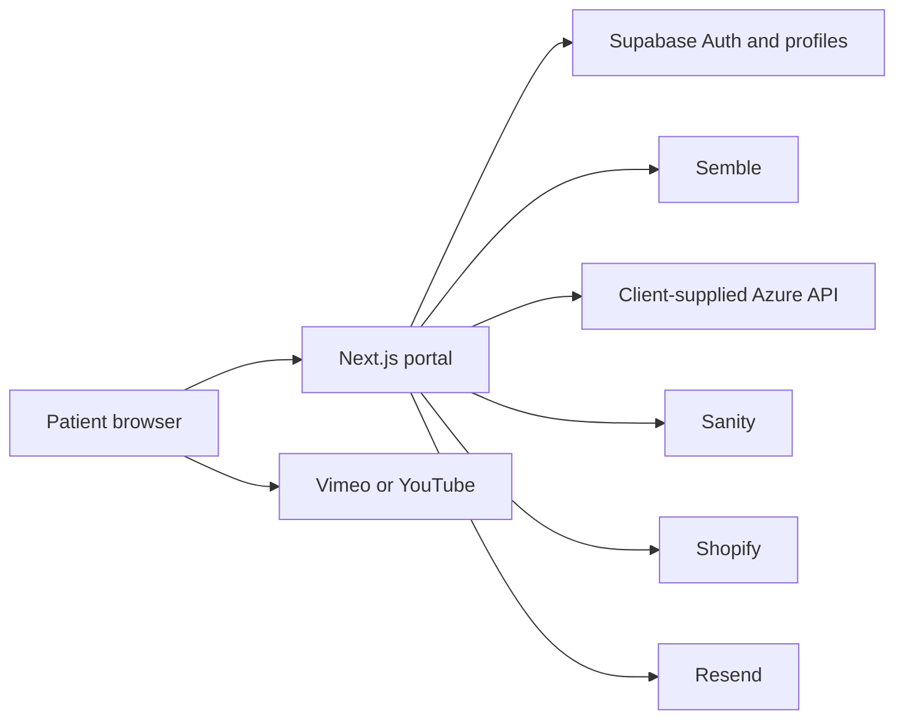

# Indra Patient Portal — Technical Handover

**Version:** 1.0
**Prepared:** 30 September 2026

## Purpose and scope

This document describes the source-code handover for the Indra patient portal.
It covers the application and its configuration requirements. It does not
include credentials, deployment configuration, Supabase Auth users or data,
Sanity content, or data and services operated by third parties.

The portal is a Next.js 16 / React 18 / TypeScript application with an embedded
Sanity Studio. It provides authenticated patient access to content,
appointments, prescriptions, invoices, billing history, password management,
and external service links.

## Architecture



The portal retrieves patient-specific data server-side. Embedded video and
external payment, meeting, shop, and subscription links open with their
respective providers.

## Requirements and local setup

- Node.js `22.22.2`
- pnpm `11.19.0`
- Access to the external services listed below, or replacements configured in
  the environment

```bash
pnpm install
cp .env.example .env.local
pnpm dev
```

The portal runs at `http://localhost:3000`; Sanity Studio is available at
`/studio`.

`.env.example` is the authoritative list of required environment-variable
names. Secrets must be configured only in local or deployment environment
settings and must not be committed to source control.

## Authentication and Supabase

Supabase Auth provides password authentication and session cookies. The
middleware validates the current user on each request so Supabase can refresh
an expiring session. Protected routes redirect unauthenticated users to
`/login`.

The application-owned schema is in
`supabase/profiles-and-tokens.sql`. It creates two tables:

- `profiles`: portal email, Supabase Auth user ID, Semble patient ID, patient
  name, and account-completion timestamp.
- `tokens`: registration and password-reset tokens, expiry and use timestamps,
  plus short-lived reset-token claim fields (`locked_at` and `locked_by`).

For a Supabase project, run the schema file in the Supabase SQL Editor.

Registration links and password-reset links expire after one hour. Password
resets atomically claim a token for five minutes, update the password, then
mark the token used. A failed password update releases the claim so the patient
can retry. Registration requires the portal profile to link successfully to
the new Auth user; a failed link removes the newly created Auth user. A valid
retry can repair a previously created but unlinked Auth user.

## Integrations

| Service | Use | Configuration / ownership boundary |
|---|---|---|
| Supabase | Authentication, profiles and tokens | `NEXT_PUBLIC_SUPABASE_URL`, publishable key, and server-only `SUPABASE_SECRET_KEY` |
| Semble | Patient matching, appointments and prescription documents | Server-only `SEMBLE_API_KEY` |
| Azure API | Invoices and billing history | `AZURE_BASE_URL`; the endpoint implementation and its access controls are not included |
| Sanity | Portal content and embedded Studio | Sanity project and dataset variables; no dataset export is included |
| Shopify | Product catalogue and external product links | Storefront domain and token variables |
| Resend | Registration and password-reset email | Server-only `RESEND_API_KEY`; sender domain must be authorised |
| Vimeo / YouTube | Resource video embeds | Video privacy and embedding must permit the portal origin |

Semble registration matching searches paginated results for an exact,
case-insensitive email match and then verifies the date of birth. The Azure API
is called from the portal server, not directly by the browser; its own
authentication, authorisation, network controls, data source, and retention
remain responsibilities of its owner.

## Failure behaviour

The frontend route group has a patient-safe error screen with a retry action.
The invoices page handles unavailable or malformed Azure responses, and the
settings page handles a missing profile, without exposing integration details
to the patient. Other upstream failures are surfaced through the route error
screen.

## Validation and deployment

Before deployment, run:

```bash
pnpm lint
pnpm build
```

Complete manual checks using non-production data where possible:

- registration, login, logout, session persistence, and password reset;
- protected-route redirects;
- Semble appointments and prescription documents;
- Azure invoices and billing history, including an unavailable-endpoint case;
- Sanity content and Studio access; and
- Shopify links and Vimeo/YouTube embeds.

Deploy to a Node.js-compatible platform such as Vercel. Configure every
environment variable, set `NEXT_PUBLIC_BASE_URL` to the deployed origin, and
allow that origin in Sanity's CORS configuration. External accounts, DNS,
email-domain verification, deployment settings, monitoring, backup recovery,
and third-party service access are operational dependencies not created by
this repository.
