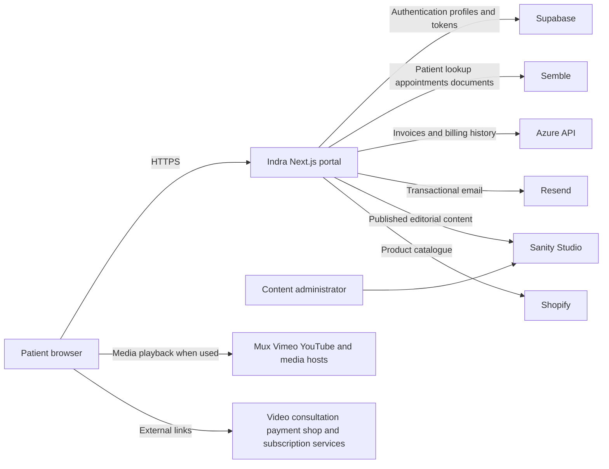

# Indra Patient Portal Technical Documentation

**Document status:** Draft for client review  
**Version:** 0.1  
**Prepared:** 23 September 2026  
**System:** Indra patient portal  
**Document owner:** [Confirm owner]  
**Technical owner:** [Confirm technical owner]

## 1. Purpose

This document describes the current Indra patient portal implementation for technical handover, security review, support, and future development. It covers the application architecture, principal user journeys, data flows, integrations, configuration, deployment model, and known technical actions.

The description is based on the application source code at commit `17d9182` on the `main` branch. Supplier configuration, infrastructure settings, database policies, contracts, and the separate Azure services are outside this repository and must be confirmed by the relevant system owners.

## 2. System summary

Indra is an authenticated web portal for patients. It brings together information from several systems so a patient can:

- register after matching their email address and date of birth against a Semble patient record;
- sign in and manage their password;
- view upcoming and previous appointments and join a video consultation;
- view and download prescription documents;
- view unpaid invoices and payment history;
- access health and wellbeing content;
- browse product information and follow links to external commerce and subscription services; and
- view useful links configured by content administrators.

The application is a Next.js and React server-rendered web application. Supabase provides authentication and portal profile records. Semble is the source of appointment and prescription data. Billing information is retrieved through an Azure-hosted API. Sanity provides editorial content, Shopify provides product catalogue data, and Resend delivers registration and password-reset emails.

## 3. System context

The portal application acts as an orchestration layer. It generally retrieves data on the server and renders a patient-specific response. The browser also connects directly to external destinations when a user plays embedded media, joins a meeting, downloads a document, pays an invoice, or follows a shop or subscription link.

## 4. Technology stack

| Layer | Technology | Role |
|---|---|---|
| Web application | Next.js 16, React 18, TypeScript | Routing, server rendering, server actions, UI and protected layouts |
| Styling | Tailwind CSS 4, local PP Mori fonts | Responsive presentation and typography |
| Authentication and portal data | Supabase Auth and Supabase database | Password authentication, sessions, profiles and one-time tokens |
| Content management | Sanity | Pages, articles, resources, navigation, media references and SEO content |
| Clinical system | Semble GraphQL API | Patient identity match, appointments and patient documents |
| Billing integration | Azure-hosted HTTP API | Current invoices and billing history |
| Commerce catalogue | Shopify Storefront GraphQL API | Product catalogue and external product links |
| Transactional email | Resend | Registration and password-reset emails |
| Media | Mux, Vimeo, YouTube and Sanity-hosted assets | Video, audio and resource playback |
| Date and time | Luxon and browser time-zone detection | Date-of-birth comparison and localised appointment display |
| Documented hosting target | Vercel | Production and preview deployment, subject to confirmation |

## 5. Application structure

The application uses the Next.js App Router.

- `src/app/(frontend)/(auth)` contains login, registration, password setup, and password reset routes.
- `src/app/(frontend)/(protected)` contains authenticated portal routes.
- `src/app/(sanity-admin)/studio` exposes the Sanity Studio route.
- `src/lib/actions` contains server actions for authentication and account lifecycle operations.
- `src/lib/supabase` contains browser, server, administrative, session, and data-access clients.
- `src/lib/semble`, `src/lib/azure`, and `src/lib/shopify` contain external API clients and queries.
- `src/sanity` contains CMS configuration, schemas, queries, and utilities.
- `src/components` contains user interface components organised by feature and presentation role.

Protected routes call Supabase Auth on the server. An unauthenticated request is redirected to `/login`. The root frontend layout also retrieves the authenticated user's portal profile and makes it available to UI components through a React context provider.

## 6. Main user journeys

### 6.1 Registration

1. The user submits an email address and date of birth.
2. The server queries Semble for the email address.
3. The server selects an exact case-insensitive email match and compares the submitted date of birth with Semble's value by calendar day.
4. If a match exists, the portal creates or updates a Supabase `profiles` record containing the email, first name, last name, and Semble patient identifier.
5. The portal creates a random 32-byte registration token with a one-hour expiry.
6. Resend emails a registration link to the patient.
7. The patient follows the link and sets a password.
8. Supabase Auth creates a confirmed user, the profile is linked to the Supabase user identifier, and the token is marked as used.

The public response deliberately uses a general error for failed patient matching, reducing direct disclosure of whether a patient record exists.

### 6.2 Login and session handling

The user submits an email address and password to a server action. Supabase Auth verifies the credentials and issues session cookies through its server-side rendering client. Protected layouts verify the current user on the server before rendering protected content. Logout invalidates the Supabase session and redirects to the login page.

### 6.3 Password reset

1. The user submits an email address.
2. The server looks for a matching portal profile.
3. If a profile exists, the portal generates a one-hour token and sends a reset link through Resend.
4. The reset page validates the token and updates the password through the Supabase administrative API.

The forgot-password response does not reveal whether a profile exists. A token-use defect is noted in section 13 and should be corrected before production approval.

### 6.4 Appointments

The server retrieves the user's portal profile, sends the stored Semble patient identifier to Semble, and requests bookings from 1900 through approximately ten years in the future. The application separates past and future bookings and displays the appointment title, dates, times, and meeting URL.

### 6.5 Prescriptions

The server requests the patient's document list from Semble. The current implementation filters returned documents whose names contain `pink`, sorts them by creation date, and presents the document name, date, and Semble-provided download URL.

### 6.6 Invoices

The server sends the patient's email address to an Azure-hosted API. Separate endpoints return unpaid invoices and billing history. The portal displays invoice references, descriptions, quantities, amounts, payment status, payment links, transaction identifiers, paid dates, and delivery fees where present.

### 6.7 Content, media, and commerce

Published pages, articles, resources, navigation, and SEO data are retrieved from Sanity. Product catalogue data is retrieved from Shopify. Some resources use Mux, Vimeo, YouTube, hosted audio, or `noembed.com` for media metadata. Purchases, payment, meeting attendance, and subscription management occur on external services reached through links.

## 7. Data model visible in this repository

### 7.1 Supabase profile

| Field | Purpose |
|---|---|
| `id` | Links the profile to a Supabase Auth user |
| `semble_id` | Links the portal user to a Semble patient |
| `email` | Login, patient matching, billing lookup, and transactional email |
| `first_name` and `last_name` | Personalisation and registration email |
| `created_at` | Profile creation timestamp |
| `completed_at` | Indicates completed account setup; referenced in code but not declared in the local TypeScript profile type |

### 7.2 One-time token

| Field | Purpose |
|---|---|
| `email` | Account to which the link applies |
| `type` | `registration` or `password_reset` |
| `token` | Random link credential |
| `expires_at` | One-hour expiry |
| `used_at` | Records consumption and prevents reuse |

The database schema, constraints, indexes, row-level security policies, backups, and retention rules are not included in the repository. They must be exported from Supabase or documented separately.

### 7.3 Data retrieved without local persistence shown

The application retrieves appointments and patient documents from Semble and billing records from the Azure API for presentation. No application code in this repository writes those records to a local database. Platform logs, caches, monitoring tools, and upstream systems may nevertheless retain request or response information and require separate review.

## 8. Integration inventory

| Integration | Direction | Data used by the portal | Authentication visible in code |
|---|---|---|---|
| Supabase | Read and write | Auth users, session data, profiles and tokens | Publishable key for user sessions; secret service key for server administration |
| Semble | Read | Email, date of birth, patient ID, name, appointments, meeting URL, document metadata and download URL | Server-side `x-token` API key |
| Azure API | Read | Patient email or ID, invoices and billing history | No application credential or signature is visible in this repository; confirm network or upstream controls |
| Resend | Write | Recipient email, first name, registration or reset link | Server-side API key |
| Sanity | Read and editorial write through Studio | Published content, media references and SEO data | Public project and dataset identifiers; Studio access and any private dataset controls require confirmation |
| Shopify | Read | Product catalogue and product URLs | Storefront access token |
| Mux, Vimeo and YouTube | Browser playback | Media request data and normal connection metadata | Public playback identifiers or provider embed APIs |
| noembed.com | Browser request | Encoded public media URL and normal connection metadata | None |

## 9. Configuration

The source references the following environment variables. Values must be stored in the deployment platform's secret manager and must not be committed to source control.

| Variable | Classification | Purpose |
|---|---|---|
| `NEXT_PUBLIC_BASE_URL` | Public configuration | Canonical portal URL used in links and metadata |
| `NEXT_PUBLIC_SUPABASE_URL` | Public configuration | Supabase project URL |
| `NEXT_PUBLIC_SUPABASE_PUBLISHABLE_KEY` | Public credential | Supabase browser/server client key designed for public use |
| `SUPABASE_SECRET_KEY` | Secret | Supabase administrative operations |
| `SEMBLE_API_KEY` | Secret | Semble API access |
| `AZURE_BASE_URL` | Internal configuration | Base URL for the billing API |
| `RESEND_API_KEY` | Secret | Transactional email delivery |
| `NEXT_PUBLIC_SANITY_PROJECT_ID` | Public configuration | Sanity project identifier |
| `NEXT_PUBLIC_SANITY_DATASET` | Public configuration | Sanity dataset name |
| `NEXT_PUBLIC_SANITY_API_VERSION` | Public configuration | Optional Sanity API version |
| `SANITY_API_READ_TOKEN` | Secret if used | Authenticated Sanity read access; present in environment files but not referenced by the current fetch client |
| `NEXT_PUBLIC_SHOPIFY_STORE_DOMAIN` | Public configuration | Shopify storefront domain |
| `NEXT_PUBLIC_SHOPIFY_STOREFRONT_API_TOKEN` | Public storefront credential | Shopify Storefront API access |
| `NEXT_PUBLIC_SHOPIFY_STOREFRONT_CUSTOM_DOMAIN` | Public configuration | Customer-facing product domain |
| `NEXT_PUBLIC_SANITY_MAPBOX_ACCESS_TOKEN` | Public credential if used | Mapbox in Sanity Studio |

The local `.env.default` file is incomplete compared with the variables required by the application and should be updated with names and descriptions only.

## 10. Security and privacy controls evidenced in code

- Protected route groups verify the Supabase user on the server.
- Patient-system and administrative API credentials are referenced only from server-side modules.
- Authentication sessions use Supabase's cookie integration rather than custom browser token storage.
- Registration and reset tokens are generated with Node's cryptographically secure random byte generator and expire after one hour.
- Registration matches both email and date of birth before account creation.
- Forgot-password uses a non-enumerating response when an account is absent.
- External meeting and prescription links open with `noopener` and `noreferrer` in the reviewed components.
- Server-side patient and billing fetches are configured without application caching where explicitly set; the Sanity content client also uses `no-store`.
- Passwords must be at least eight characters and are stored and verified by Supabase Auth, not by application code.

Controls that may exist in Supabase, Vercel, Azure, Semble, Sanity, Resend, Shopify, or organisational procedures are not evidenced by this repository and should not be assumed without configuration or contractual evidence.

## 11. Deployment and operations

The README describes Vercel as the target deployment platform, with `main` mapped to production and `staging` mapped to a preview environment. This must be reconciled with the actual deployment configuration.

Recommended release workflow:

1. Run dependency installation from the lockfile.
2. Run formatting, linting, type checking, automated tests, and a production build.
3. Deploy to an isolated preview environment with non-production data and credentials.
4. Complete functional, accessibility, security, and privacy acceptance checks.
5. Obtain the required release and DPIA approvals.
6. Promote the reviewed revision to production.
7. Monitor authentication, external API failures, email delivery, and availability without logging health data or secrets.

The repository currently defines `dev`, `build`, `start`, and an obsolete `next lint` command, but no automated test or dedicated type-check script. CI/CD definitions, monitoring, alerting, backup recovery, incident response, and rollback procedures are not present in the repository.

## 12. Support and failure behaviour

External services are runtime dependencies. A failure in Supabase prevents authentication or profile retrieval. A Semble failure affects registration, appointments, or prescriptions. An Azure API failure affects invoices. Sanity or Shopify failures affect content and catalogue rendering. Resend failure prevents registration and password-reset email delivery.

The application currently throws for several upstream non-success responses and has limited feature-level fallback UI. Operational monitoring should distinguish availability failures from application defects, and user-facing error states should avoid disclosing supplier details, identifiers, or sensitive data.

## 13. Known issues and recommended actions

### Priority 0 before production approval

1. **Correct password-reset token consumption.** Reset tokens are validated in the `tokens` table, but the reset action updates `password_reset_tokens`. The validated token may therefore remain usable until expiry. Use the same atomic token-consumption mechanism as registration and add a regression test.
2. **Confirm service-to-service protection for the Azure API.** The portal sends health-adjacent billing requests without an application credential visible in this code. Require authenticated and authorised calls, transport encryption, replay resistance where appropriate, and server-side checks that the caller may retrieve the requested patient.
3. **Add abuse controls.** Apply rate limiting, monitoring, and temporary throttling to registration, login, forgot-password, set-password, and reset-password operations. Review whether email plus date of birth provides sufficient registration assurance for the risk.
4. **Verify database controls.** Document and test Supabase row-level security, service-role restrictions, unique constraints, token hashing or equivalent protection, backups, retention, and administrative access controls.

### Priority 1 security and privacy hardening

1. Parameterise or safely escape Semble GraphQL inputs rather than interpolating email and patient identifiers directly into query strings.
2. Fetch only the Semble document categories required for the prescription view if the API supports filtering, instead of retrieving all patient documents and filtering by filename in the portal.
3. Confirm that meeting and document URLs are short-lived or independently access-controlled and do not grant access solely through possession of a long-lived URL.
4. Set and test an explicit Content Security Policy, HSTS, permissions policy, frame policy, and other appropriate response headers.
5. Define log redaction rules and verify that platform, Azure, and supplier logs do not capture tokens, dates of birth, document URLs, meeting URLs, or medical and billing content.
6. Replace broad Supabase administrative operations where a narrower server-side function or scoped credential is available.
7. Align `NEXT_PUBLIC_SUPABASE_ANON_KEY` and `NEXT_PUBLIC_SUPABASE_PUBLISHABLE_KEY` naming and remove unused environment variables.
8. Review third-party media loading and consent requirements, particularly YouTube, Vimeo, and `noembed.com` browser requests.

### Priority 2 maintainability and resilience

1. Add automated tests for account lifecycle, authorisation boundaries, patient-to-profile matching, date handling, external service errors, and invoice/prescription ownership.
2. Add CI checks for formatting, linting, type safety, tests, dependency vulnerabilities, and secret scanning.
3. Document database migrations and keep them under version control.
4. Add structured, privacy-preserving monitoring, availability checks, alert ownership, and incident runbooks.
5. Add graceful loading and failure states for each upstream service.
6. Remove unused values and variables, including unused response success flags and unused imports where applicable.
7. Update the README from its starter-project form to match this system and its supported deployment procedure.

## 14. Acceptance and handover checklist

- [ ] Confirm controller, processor, technical owner, support owner, and emergency contacts.
- [ ] Confirm production and non-production hosting, regions, domains, and data separation.
- [ ] Supply an approved architecture diagram and inventory of all upstream and downstream services.
- [ ] Export and review Supabase schema, row-level security policies, authentication settings, and retention.
- [ ] Document Azure API ownership, authentication, authorisation, data sources, logging, and retention.
- [ ] Confirm Semble, Supabase, Vercel, Resend, Sanity, Shopify, Mux, Vimeo, YouTube, and Azure contractual and transfer arrangements.
- [ ] Complete penetration testing and remediate high and critical findings.
- [ ] Complete accessibility testing against the agreed WCAG target.
- [ ] Complete browser and device acceptance testing.
- [ ] Approve privacy notice, cookie controls, records of processing, retention schedule, incident plan, and DPIA.
- [ ] Test backup restoration, credential rotation, rollback, and supplier outage procedures.
- [ ] Record go-live approval and residual risks.

## 15. Items requiring client confirmation

1. Legal entity names and whether Indra is the controller, joint controller, or processor for each data flow.
2. Production hosting provider, regions, domains, and deployment environments.
3. Supabase database schema, policies, backup settings, and residency.
4. The purpose, owner, authentication, and hosting arrangement for the Azure billing API.
5. Data retention periods for profiles, authentication records, tokens, logs, email records, appointments, prescriptions, and invoices.
6. Supplier data locations, subprocessors, data processing agreements, and international transfer safeguards.
7. The actual scale of processing, patient population, age range, and whether vulnerable adults or children use the service.
8. Security monitoring, support, incident response, recovery objectives, and breach-notification responsibilities.
9. Whether analytics, advertising, error tracking, or other services are configured outside this repository.
10. The formal lawful bases and special-category condition adopted by the controller.

## 16. Document maintenance

Review this document before go-live, after material architecture or supplier changes, after security incidents, and at least annually. Changes to authentication, patient matching, health-data access, billing integrations, hosting regions, or external processors should trigger a corresponding review of the DPIA.
